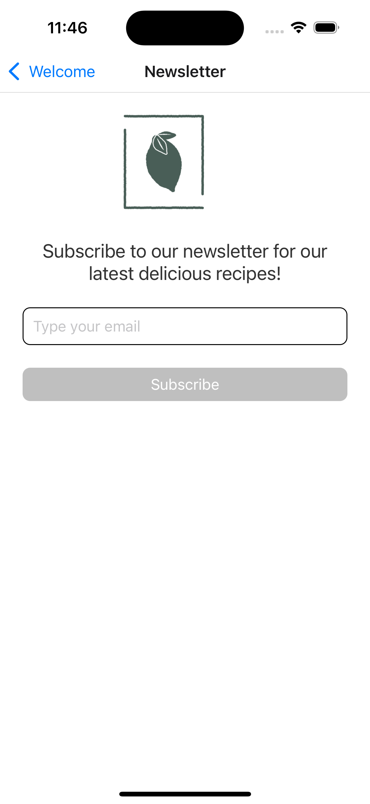

# 🍋 Little Lemon

**Little Lemon** is a Mediterranean-inspired bar and small plates restaurant application. It focuses on fresh produce, bold flavors, bespoke cocktails, and a premium wine selection.

---

## 📑 Table of Contents

1. [Overview](#-overview)
2. [Technologies](#-technologies)
3. [Packages & Libraries Used](#-packages--libraries-used)
4. [Getting Started](#-getting-started)
5. [Setup](#-setup)
6. [Features](#-features)
7. [Demo & Screenshots](#-demo--screenshots)
8. [Acknowledgments](#-acknowledgments)
9. [License](#-license)

---

## 🌟 Overview

**Description**:  
The **Little Lemon** application provides an intuitive and visually appealing experience to explore the restaurant’s menu, subscribe to newsletters, and enjoy Mediterranean cuisine digitally.

---

## 💻 Technologies

This project is built with:

| Technology       | Description                         |
| ---------------- | ----------------------------------- |
| **React Native** | Cross-platform mobile framework     |
| **TypeScript**   | Ensures type safety and scalability |

---

## 📦 Packages / Libraries Used

| Package / Library  | Purpose                          |
| ------------------ | -------------------------------- |
| `Expo`             | Simplifies development & testing |
| `React Navigation` | Enables smooth app navigation    |

---

## 🚀 Getting Started

1. Install Node.js
2. Visual Studio Code or Any Fav IDE

---

## ⚙️ Setup

1. Clone the repo:

   ```bash
   git clone https://github.com/Jenil-Desai-Little-Lemon
   ```

2. Go To Folder:

   ```bash
   cd little-lemon
   ```

3. Install Dependencies:

   ```bash
   npm install
   ```

4. Start The Application:
   ```bash
   npm start
   ```

---

## 🎯 Features

1. **Welcome Screen** - Greet users with a beautiful introduction.
2. **Menu Screen** - Explore Mediterranean-inspired dishes and drinks.
3. **Subscribe to Newsletter** - Stay updated with the latest offers.

---

## 🔗 Demo & Screenshots

|                                            Welcome Screen | Menu Screen                                         | Newsletter Screen                                               |
| --------------------------------------------------------: | --------------------------------------------------- | --------------------------------------------------------------- |
|  |  |  |

---

## 🙏 Acknowledgments

Special thanks to the following resources:

1. [Coursera Meta Official React Native Course](https://www.coursera.org/learn/react-native-course)
2. [Expo Documentation](https://docs.expo.dev/)

---

## 📜 License

This project is licensed under the [MIT License](LICENSE). See the [LICENSE](LICENSE) file for details.

---

### 🍋 Experience fresh Mediterranean flavors with **Little Lemon**!
